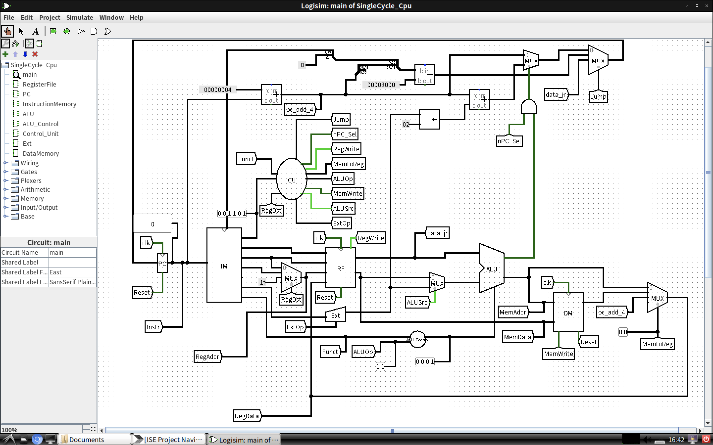
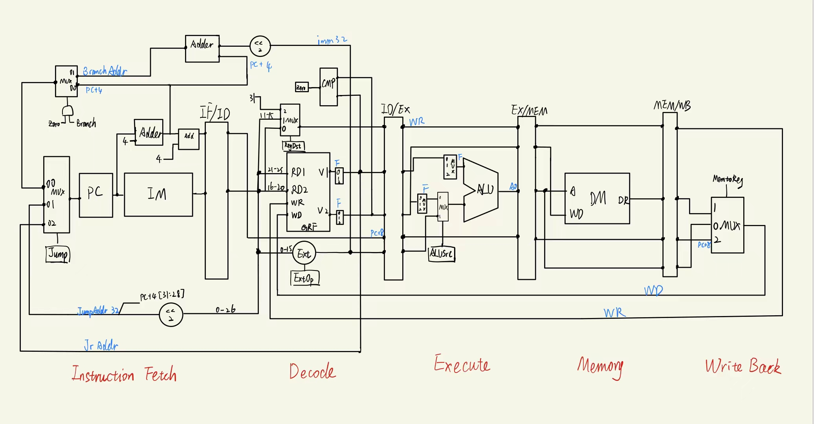

# BUAA-CO-2022-Fall
北航计算机学院2021级计算机组成课设

* 该课设最终实现了一个**具有异常处理功能的五级流水线CPU**。支持MIPS架构，可实现数十条基本的常用指令，如基本的四则运算、跳转、访存等。使用的编程语言为Verilog。
* **课设总览**：分为7个project，P1-P3可以看做准备阶段，正式的CPU的架构从P4开始，之后的Project依次迭代开发：
  * P1: Verilog入门
  * P2: MIPS入门
  * P3: 用Logisim搭建单周期CPU
  * P4: Verilog实现单周期CPU
  * P5: 实现流水线CPU
  * P6: 引入乘除法
  * P7: 实现异常处理
* 仅为**课下代码**，上机考试代码未保存
* 最终通过了P7的上机考试与课下所有的评测点。不能保证没有bug。
* 感想：回看这份代码还是比较感慨，来到六系以后的第一个挑战，当时的代码风格还比较青涩，也不会用markdown，没有养成很好的记录习惯，甚至设计文档还是手写，很遗憾没有保留下来。总体来说计组绝对担当得起六系所谓的“金课”的称谓，是真的能学到东西的一门好课。

放两张图总结一下，一张是Logisim单周期CPU，另一张是本人手绘的流水线CPU。

